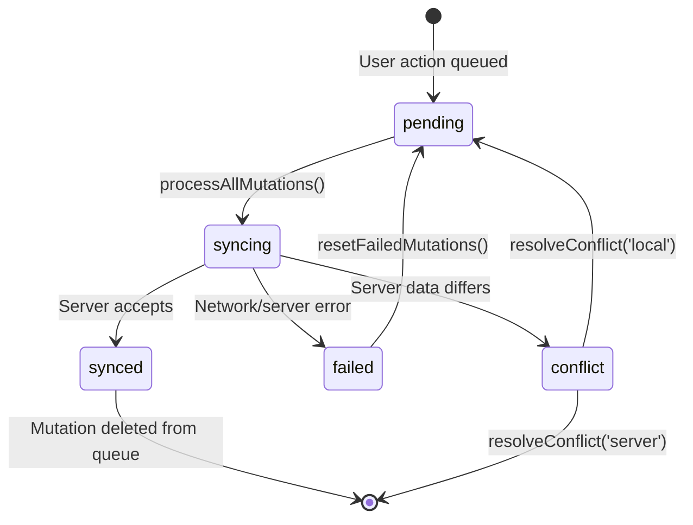
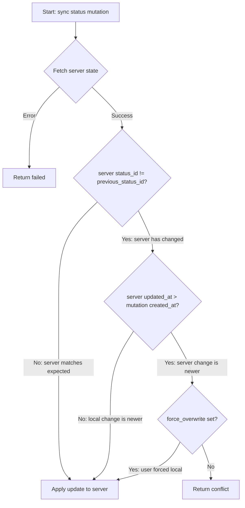
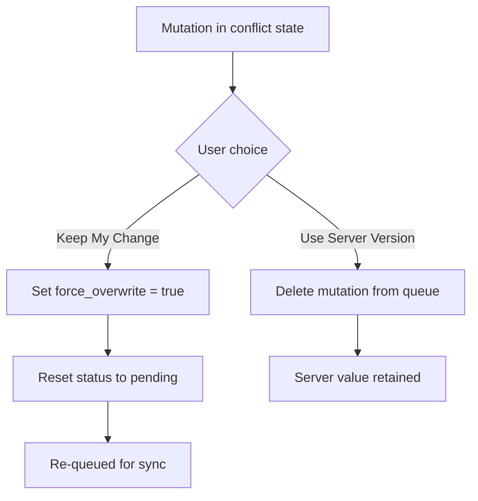

# Offline Sync Architecture

## 1. Overview

The FieldOps offline sync system enables field crews to continue working without network connectivity. When a user performs a mutation (status change, comment, photo, or file upload) while offline, the action is queued in IndexedDB rather than sent to the server. When connectivity is restored, the queue is processed in parallel batches, sending each mutation to Supabase and handling any conflicts that arise.

The system is built around four key components. The **mutation queue** (powered by Dexie.js over IndexedDB) persists pending changes as structured records with explicit lifecycle states. The **sync processor** orchestrates the sync operation, dispatching mutations to their type-specific handlers and updating queue state based on results. The **batch processor** manages parallel execution with concurrency limits and rate-limit retry logic. The **conflict resolution UI** surfaces status conflicts to the user and applies their chosen resolution.

All sync logic lives in `lib/offline/`: `db.ts` (schema and types), `mutation-queue.ts` (queue CRUD), `sync-processor.ts` (sync orchestration), `batch-processor.ts` (parallel batching), `backoff.ts` (retry timing), and `use-background-sync.ts` (React hook for triggering sync). The conflict resolution UI lives in `components/offline/conflict-resolution.tsx`.

---

## 2. Mutation Lifecycle State Machine

Every mutation in the queue follows the same five-state lifecycle. The diagram below shows all states and the transitions between them.

**Important:** The `synced` state is transient. When a mutation reaches `synced`, it is immediately deleted from the IndexedDB queue. No mutation persists in the `synced` state; it exists only as a momentary marker before removal.

### State Reference

| State | Description | Duration | Code Location |
|-------|-------------|----------|---------------|
| `pending` | Queued for sync, waiting to be sent to server | Persists until sync starts | `mutation-queue.ts` (queueStatusMutation, queueCommentMutation, queuePhotoMutation, queueFileMutation) |
| `syncing` | Currently being sent to the server | During active sync operation | `sync-processor.ts` (processAllMutations) |
| `synced` | Server accepted the mutation (transient -- immediately deleted) | Momentary | `sync-processor.ts` (processAllMutations) |
| `failed` | Network or server error prevented sync | Until user retries or auto-retry | `sync-processor.ts` (processAllMutations) |
| `conflict` | Server data differs from what the client expected | Until user resolves | `sync-processor.ts` (processStatusMutation) |

### Transition Reference

| # | From | To | Trigger | Code Reference |
|---|------|----|---------|---------------|
| 1 | (new) | `pending` | User performs an action (status change, comment, photo, file) | `mutation-queue.ts`: queueStatusMutation(), queueCommentMutation(), queuePhotoMutation(), queueFileMutation() |
| 2 | `pending` | `syncing` | processAllMutations() begins sync | `sync-processor.ts`: `Promise.all(mutations.map(m => updateMutationStatus(m.id, 'syncing')))` |
| 3 | `syncing` | `synced` | Server accepts the mutation | `sync-processor.ts`: `updateMutationStatus(mutation.id, 'synced')` |
| 4 | `synced` | (deleted) | Cleanup after successful sync | `sync-processor.ts`: `deleteMutation(mutation.id)` (called immediately after setting synced) |
| 5 | `syncing` | `failed` | Network error or server rejection | `sync-processor.ts`: `updateMutationStatus(mutation.id, 'failed', result.error)` |
| 6 | `syncing` | `conflict` | Server data differs from expected (status mutations only) | `sync-processor.ts`: `markMutationConflict(mutation.id, result.conflict)` |
| 7 | `failed` | `pending` | User or system triggers retry | `mutation-queue.ts`: resetFailedMutations() |
| 8 | `conflict` | `pending` | User chooses "Keep My Change" (local wins) | `mutation-queue.ts`: resolveConflict(mutationId, 'local') -- sets force_overwrite=true |
| 9 | `conflict` | (deleted) | User chooses "Use Server Version" (server wins) | `mutation-queue.ts`: resolveConflict(mutationId, 'server') -- deletes mutation from queue |

---

## 3. Mutation Types

The system supports four types of mutations, each corresponding to a different user action.

| Type | Action | Payload | Can Conflict? | Why |
|------|--------|---------|---------------|-----|
| `status` | Change a task's status | task_id, status_id, previous_status_id | **Yes** | Updates an existing field -- another user could have changed the same field |
| `comment` | Add a comment to a task | task_id, content, temp_id | No | Additive (creates a new record, never overwrites) |
| `photo` | Upload a photo to a task | task_id, blob, timestamp, GPS coords, temp_id | No | Additive (creates a new record, never overwrites) |
| `file` | Upload a file to a task | task_id, blob, file_name, file_size, temp_id | No | Additive (creates a new record, never overwrites) |

**Only status mutations have conflict detection.** Comment, photo, and file mutations are create-only operations -- they add new records to the database rather than updating existing ones. Since they do not overwrite existing data, there is no possibility of conflict. The conflict detection logic in `processStatusMutation()` specifically checks whether the server's current value differs from the value the client assumed when queuing the change.

---

## 4. Conflict Resolution Flow

When syncing a status mutation, the system checks whether the server state has diverged from what the client expected. The following flowchart shows the decision tree inside `processStatusMutation()`.

### Conflict Detection Conditions

All three conditions must be true for a conflict to be detected:

1. **Server status differs from expected:** The server's current `status_id` does not match the `previous_status_id` that the client recorded when the mutation was queued. This means another user (or system) changed the task's status after the local user queued their change.

2. **Server change is newer:** The server's `updated_at` timestamp is later than the mutation's `created_at` timestamp. This confirms the server change happened after the local mutation was queued, not before.

3. **Not a forced overwrite:** The mutation does not have the `force_overwrite` flag set. This flag is only set when a user has already seen the conflict and explicitly chosen "Keep My Change."

If any of these conditions is false, no conflict is detected and the update proceeds normally.

### User Resolution Options

When a conflict is detected, the mutation enters the `conflict` state and the user is presented with two choices in the conflict resolution UI (`components/offline/conflict-resolution.tsx`):

**"Keep My Change" (local wins):** The mutation's `force_overwrite` flag is set to `true`, its status is reset to `pending`, and the conflict info is cleared. On the next sync cycle, `processStatusMutation()` will see `force_overwrite=true` and skip conflict detection, applying the local change unconditionally. Code: `resolveConflict(mutationId, 'local')` in `mutation-queue.ts`.

**"Use Server Version" (server wins):** The mutation is deleted from the queue entirely. The server's current value is kept as-is. Code: `resolveConflict(mutationId, 'server')` in `mutation-queue.ts`.

---

## 5. Processing Architecture

Individual mutations follow the state machine described above, but processing happens in parallel batches rather than sequentially. The batch processor separates mutations by type and applies different concurrency limits.

### Batch Processing Flow

1. **Collect pending mutations** from IndexedDB, ordered by `created_at`.
2. **Mark all as `syncing`** in a single batch operation.
3. **Separate by type:**
   - Data mutations (status, comment) -- smaller payloads, faster to process.
   - File mutations (photo, file) -- larger payloads, slower uploads.
4. **Process data mutations first** with concurrency limit of **5** (`DATA_CONCURRENCY`).
5. **Then process file mutations** with concurrency limit of **2** (`FILE_CONCURRENCY`).
6. **Handle results:** For each mutation, update its state to `synced` (then delete), `failed`, or `conflict` based on the server response.

Concurrency is managed by `p-limit`, and each batch uses `Promise.allSettled` so that one mutation's failure does not abort the others.

### Rate Limit Handling

When a rate limit error (HTTP 429) is detected in any batch result, the system applies exponential backoff with bounded jitter before retrying:

- **Base delay:** 1000ms
- **Max delay:** 60000ms
- **Jitter:** +/- 25% (bounded, prevents thundering herd)
- **Max retries:** 5

The backoff formula is: `min(maxDelay, baseDelay * 2^attempt) * (1 +/- jitterFactor)`.

On retry, only the failed mutations are re-sent -- successful mutations from the same batch are preserved. Code: `processBatchWithRateLimit()` in `batch-processor.ts`, `calculateBackoff()` in `backoff.ts`.

---

## 6. Sync Triggers

The system supports four ways to initiate a sync operation.

| Trigger | Mechanism | Automatic? | Code Reference |
|---------|-----------|------------|---------------|
| App comes online | `useBackgroundSync` detects connectivity change via `useOnlineStatus`, checks for pending mutations, triggers sync | Yes | `use-background-sync.ts`: online detection effect |
| User taps "Sync Now" | Manual sync button calls `syncNow()` | No (user-initiated) | `use-background-sync.ts`: syncNow() |
| Service Worker Background Sync | Service worker fires sync event, posts `SYNC_MUTATIONS` message to client | Yes (browser-managed) | `sw.js`: Background Sync handler; `use-background-sync.ts`: message listener |
| User retries failed | "Retry" action calls `resetFailedMutations()` then `syncNow()` | No (user-initiated) | `use-background-sync.ts`: retryFailed() |

All four triggers ultimately call `processAllMutations()` in `sync-processor.ts`, which delegates to `processBatchWithRateLimit()` in `batch-processor.ts`.

---

## 7. File Reference

| File | Role |
|------|------|
| `lib/offline/db.ts` | Dexie schema, type definitions for MutationType, MutationStatus, ConflictInfo, and all payload types |
| `lib/offline/mutation-queue.ts` | Queue CRUD: enqueue mutations, update status, resolve conflicts, reset failed, delete synced |
| `lib/offline/sync-processor.ts` | Sync orchestration: processes all pending mutations, dispatches to type-specific handlers, manages lifecycle transitions |
| `lib/offline/batch-processor.ts` | Parallel batch processing with p-limit concurrency control and rate limit retry logic |
| `lib/offline/backoff.ts` | Exponential backoff with bounded jitter calculation and rate limit error detection |
| `lib/offline/use-background-sync.ts` | React hook: auto-sync on connectivity change, manual sync, retry failed, service worker message handling |
| `lib/offline/use-offline-sync.ts` | React hook: online/offline detection, data caching (read path from server to local cache) |
| `components/offline/conflict-resolution.tsx` | Conflict resolution UI: displays conflicts, presents local/server choice, triggers resolution |
| `components/offline/sync-status-indicator.tsx` | Sync status display: maps mutation states to user-visible indicators |
| `public/sw.js` | Service worker: caches app shell, handles Background Sync API events, posts messages to client |
| `lib/monitoring/sentry.ts` | Observability: tracks sync metrics (duration, success/failure counts) via Sentry |
