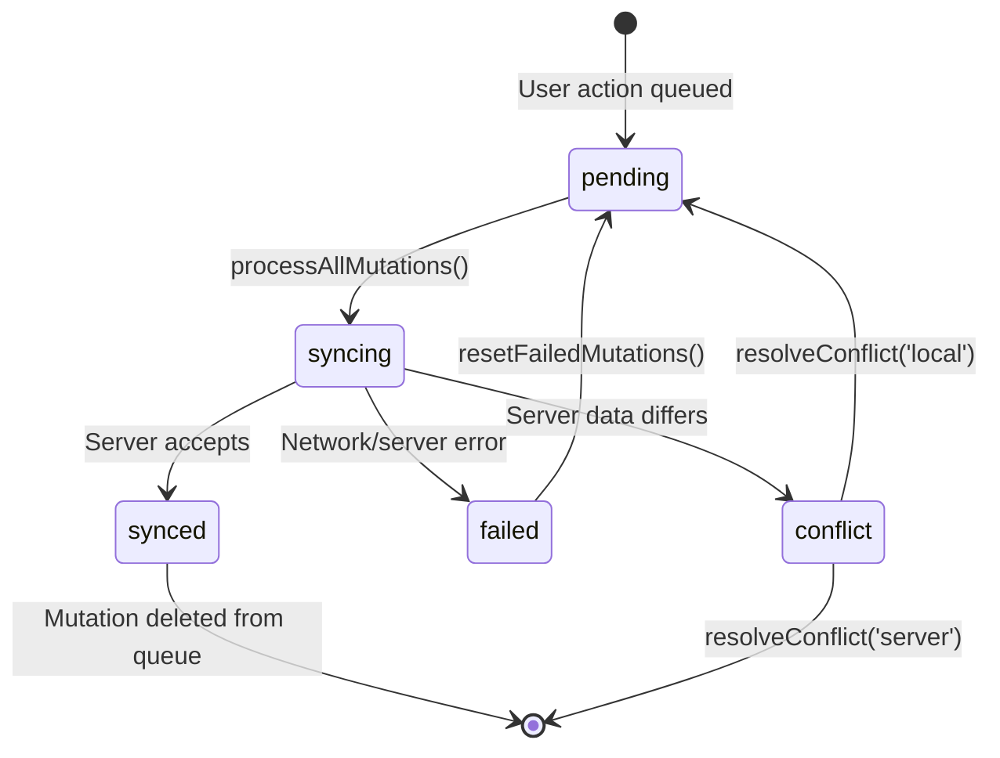
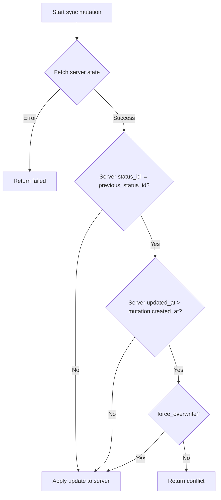

# Phase 5: Documentation - Research

**Researched:** 2026-02-14
**Domain:** Technical documentation for offline sync architecture (state machine diagrams, conflict resolution flows)
**Confidence:** HIGH

## Summary

Phase 5 is a documentation-only phase with no code changes. The goal is to produce two artifacts that satisfy QUAL-02 (mutation lifecycle state machine) and QUAL-04 (conflict resolution flow documentation). The architecture to document is now stable, having been refined through Phases 1-4 (testing, monitoring, batch sync, web workers).

The codebase already contains the complete implementation: 5 mutation statuses (`pending`, `syncing`, `synced`, `failed`, `conflict`), 4 mutation types (`status`, `comment`, `photo`, `file`), batch processing with rate limiting, and a conflict resolution UI with local/server choice. The documentation task is to extract and formalize what exists into clear diagrams and prose that a new developer can understand without reading every source file.

**Primary recommendation:** Use Mermaid state diagrams embedded in Markdown files stored in `.planning/docs/`. GitHub renders Mermaid natively, so no external tools or build steps are needed. One document covers both requirements: the mutation state machine and the conflict resolution flow.

## Standard Stack

### Core

| Tool | Version | Purpose | Why Standard |
|------|---------|---------|--------------|
| Mermaid | N/A (text-based) | State machine and flow diagrams | GitHub renders natively in Markdown; no external tools, no image files to maintain |
| Markdown | N/A | Document format | Already used throughout `.planning/`; renders in GitHub, VS Code, and any text editor |

### Supporting

| Tool | Purpose | When to Use |
|------|---------|-------------|
| GitHub Mermaid renderer | Visual diagram rendering | Viewing `.md` files on GitHub or in VS Code with Mermaid extension |

### Alternatives Considered

| Instead of | Could Use | Tradeoff |
|------------|-----------|----------|
| Mermaid | XState Visualizer | More powerful but requires runtime, deferred to QUAL-V2-01 |
| Mermaid | draw.io / Excalidraw | Richer visuals but creates binary image files that can't be diffed or maintained as code |
| Mermaid | PlantUML | Similar text-based approach but less GitHub integration (requires external renderer) |
| Markdown in `.planning/docs/` | JSDoc in source files | Source comments are for code context; architecture docs need narrative and cross-file diagrams |

**Installation:**
```bash
# No installation needed - Mermaid is rendered by GitHub and VS Code
```

## Architecture Patterns

### Recommended Document Structure

```
.planning/docs/
└── offline-sync-architecture.md   # Single document covering both requirements
```

A single document is preferred over two separate files because the mutation lifecycle and conflict resolution flow are deeply intertwined -- conflict is one of the mutation states, and understanding the resolution flow requires understanding the lifecycle first.

### Pattern 1: State Machine Diagram with Mermaid

**What:** Use `stateDiagram-v2` to represent the 5-state mutation lifecycle.
**When to use:** For any system with explicit states and transitions.
**Example:**



Source: [Mermaid State Diagram docs](https://mermaid.ai/open-source/syntax/stateDiagram.html), verified rendering on [GitHub Docs](https://docs.github.com/en/get-started/writing-on-github/working-with-advanced-formatting/creating-diagrams)

### Pattern 2: Flowchart for Decision Logic

**What:** Use Mermaid `flowchart` for the conflict detection decision tree inside `processStatusMutation()`.
**When to use:** For multi-step decision logic with branching conditions.
**Example:**



### Pattern 3: Narrative Sections Between Diagrams

**What:** Each diagram is preceded by context ("what this represents") and followed by a state/transition table ("reference details").
**When to use:** Always. Diagrams alone are insufficient without explanation of real-world triggers and consequences.

### Anti-Patterns to Avoid

- **Diagram-only documentation:** State diagrams without prose explanation of WHEN and WHY transitions happen are useless for onboarding.
- **Duplicating code comments:** Documentation should explain the architecture at a higher level than code comments. Don't repeat function signatures.
- **External hosted diagrams:** Using external tools (Lucidchart, Figma) creates links that go stale. Keep everything in-repo as text.
- **Documenting aspirational architecture:** Document what the code DOES now (post-Phase-4), not what it should do. The current implementation IS the refined architecture.

## Don't Hand-Roll

| Problem | Don't Build | Use Instead | Why |
|---------|-------------|-------------|-----|
| Diagram rendering | Custom SVG generation or image files | Mermaid in Markdown | GitHub renders natively; text-based means git-diffable |
| Documentation site | Static site generator (Docusaurus, etc.) | Plain Markdown in `.planning/docs/` | Requirements say docs live in `.planning/docs/` or codebase; no external wiki |
| State machine formalization | XState or custom reducer | Mermaid diagram + prose | Phase 5 is documentation only; XState formalization is deferred to QUAL-V2-01 |

**Key insight:** This phase produces documentation artifacts, not code. The value is in accuracy and clarity, not technical sophistication of the documentation tooling.

## Common Pitfalls

### Pitfall 1: Documenting Outdated Architecture

**What goes wrong:** Documenting the pre-Phase-3 sequential sync instead of the current batch sync.
**Why it happens:** The research docs in `.planning/research/ARCHITECTURE.md` describe the OLD sequential flow. The codebase has changed significantly since.
**How to avoid:** Document from the CURRENT source code (`sync-processor.ts`, `batch-processor.ts`), not from planning documents.
**Warning signs:** If the diagram shows sequential FIFO processing, it's wrong. Current architecture uses `processBatchWithRateLimit()`.

### Pitfall 2: Missing the "Synced Then Deleted" Terminal Transition

**What goes wrong:** Showing `synced` as a resting state when in reality mutations are immediately deleted from IndexedDB after reaching `synced`.
**Why it happens:** The type system defines `synced` as a status, but in practice `deleteMutation()` is called right after.
**How to avoid:** The state machine must show that `synced` is a transient state leading to removal from the queue.
**Warning signs:** If the diagram shows mutations staying in `synced` state, it misrepresents the lifecycle.

### Pitfall 3: Conflating Mutation Types in Conflict Documentation

**What goes wrong:** Implying all mutation types can have conflicts. Only `status` mutations have true conflict detection.
**Why it happens:** The `ConflictInfo` type is generic, but only `processStatusMutation()` actually checks for conflicts.
**How to avoid:** Clearly state that conflict detection applies to status mutations. Comment, photo, and file mutations are additive (create-only) so they don't conflict.
**Warning signs:** If the document describes conflict resolution for comments or photos, it's incorrect.

### Pitfall 4: Overcomplicating for a Documentation Phase

**What goes wrong:** Introducing code changes (state machine library, formal validation) when the phase only requires documentation.
**Why it happens:** The temptation to "improve" while documenting.
**How to avoid:** The success criteria are clear: documented state machine diagram + documented conflict flow. No code changes.
**Warning signs:** Any task that modifies `.ts` or `.tsx` files.

## Code Examples

### Current Mutation Status Type (Source: `lib/offline/db.ts`)

```typescript
export type MutationStatus = 'pending' | 'syncing' | 'synced' | 'failed' | 'conflict';
```

### Current Mutation Types (Source: `lib/offline/db.ts`)

```typescript
export type MutationType = 'status' | 'comment' | 'photo' | 'file';
```

### State Transitions in Code (Source: `lib/offline/sync-processor.ts`)

The actual transitions happen in `processAllMutations()`:

```typescript
// pending -> syncing (line 368)
await Promise.all(mutations.map(m => updateMutationStatus(m.id, 'syncing')));

// syncing -> synced + delete (lines 392-393)
await updateMutationStatus(mutation.id, 'synced');
await deleteMutation(mutation.id);

// syncing -> conflict (lines 394-396)
await markMutationConflict(mutation.id, result.conflict);

// syncing -> failed (lines 397-399)
await updateMutationStatus(mutation.id, 'failed', result.error);
```

### Conflict Detection Logic (Source: `lib/offline/sync-processor.ts`, processStatusMutation)

```typescript
const hasServerChanged = serverTask.status_id !== previous_status_id;
const isServerNewer = serverUpdatedAt > mutationCreatedAt;

if (hasServerChanged && isServerNewer && !mutation.force_overwrite) {
  // CONFLICT: server has different value than expected
}
```

### Conflict Resolution (Source: `lib/offline/mutation-queue.ts`, resolveConflict)

```typescript
if (resolution === 'local') {
  // conflict -> pending (with force_overwrite flag)
  await db.pending_mutations.update(mutationId, {
    status: 'pending',
    conflict: undefined,
    force_overwrite: true,
  });
} else {
  // conflict -> deleted (server wins, discard local change)
  await db.pending_mutations.delete(mutationId);
}
```

### Failed Mutation Retry (Source: `lib/offline/mutation-queue.ts`, resetFailedMutations)

```typescript
// failed -> pending (retry)
await db.pending_mutations.update(mutation.id, {
  status: 'pending',
  error_message: undefined,
});
```

### Batch Processing Architecture (Source: `lib/offline/batch-processor.ts`)

```typescript
// Data mutations (status, comment): concurrency 5
// File mutations (photo, file): concurrency 2
const dataMutations = mutations.filter(m => m.type === 'status' || m.type === 'comment');
const fileMutations = mutations.filter(m => m.type === 'photo' || m.type === 'file');

// Process data first, then files
const dataResults = await processWithRetry(dataMutations, DATA_CONCURRENCY);  // 5
const fileResults = await processWithRetry(fileMutations, FILE_CONCURRENCY);  // 2
```

### Backoff Configuration (Source: `lib/offline/backoff.ts`)

```typescript
// Base delay: 1000ms, max: 60000ms, jitter: +/- 25%
// Max rate limit retries: 5
export function calculateBackoff(attempt, baseDelay = 1000, maxDelay = 60000, jitterFactor = 0.25)
```

## Codebase Inventory for Documentation

### Files That Define the Architecture

| File | What It Contains | Documentation Relevance |
|------|-----------------|------------------------|
| `lib/offline/db.ts` | Dexie schema, type definitions for all mutation types and statuses | Defines the 5 states, 4 mutation types, ConflictInfo structure |
| `lib/offline/mutation-queue.ts` | Queue CRUD operations, conflict marking/resolution | Defines transitions: mark conflict, resolve conflict, reset failed |
| `lib/offline/sync-processor.ts` | Orchestrates sync: batch processing, progress reporting | Defines transitions: pending->syncing->synced/failed/conflict |
| `lib/offline/batch-processor.ts` | Parallel batch processing with rate limiting | Defines concurrency model and rate limit retry logic |
| `lib/offline/backoff.ts` | Exponential backoff with bounded jitter | Defines retry timing strategy |
| `lib/offline/use-background-sync.ts` | Auto-sync when online, service worker integration | Defines trigger mechanism for sync |
| `lib/offline/use-offline-sync.ts` | Data caching, online/offline detection | Defines read path (server -> cache -> display) |
| `components/offline/conflict-resolution.tsx` | Conflict resolution UI | Defines user-facing conflict flow (local vs server choice) |
| `components/offline/sync-status-indicator.tsx` | Sync status display | Shows how states map to UI |
| `public/sw.js` | Service worker with Background Sync | Defines background sync trigger |
| `lib/monitoring/sentry.ts` | Sync metrics tracking | Defines observability integration |

### Complete State Transition Map (Extracted from Code)

| From State | To State | Trigger | Code Location |
|-----------|----------|---------|---------------|
| (new) | `pending` | User creates mutation | `mutation-queue.ts`: queueStatusMutation, queueCommentMutation, etc. |
| `pending` | `syncing` | processAllMutations starts | `sync-processor.ts`: line 368 |
| `syncing` | `synced` | Server accepts mutation | `sync-processor.ts`: line 392 |
| `synced` | (deleted) | Cleanup after success | `sync-processor.ts`: line 393 |
| `syncing` | `failed` | Network or server error | `sync-processor.ts`: line 398 |
| `syncing` | `conflict` | Server data differs from expected | `sync-processor.ts`: line 395 |
| `failed` | `pending` | User or auto retry | `mutation-queue.ts`: resetFailedMutations |
| `conflict` | `pending` | User chooses "Keep My Change" | `mutation-queue.ts`: resolveConflict('local') |
| `conflict` | (deleted) | User chooses "Use Server Version" | `mutation-queue.ts`: resolveConflict('server') |

### Conflict Detection Conditions (Status Mutations Only)

Three conditions must ALL be true for conflict detection:
1. `serverTask.status_id !== previous_status_id` (server value differs from what client expected)
2. `serverUpdatedAt > mutationCreatedAt` (server change happened after local change was queued)
3. `!mutation.force_overwrite` (not a forced retry after conflict resolution)

### Sync Triggers

| Trigger | Mechanism | Code Location |
|---------|-----------|---------------|
| App comes online | `useBackgroundSync` auto-detects | `use-background-sync.ts`: line 151 |
| User taps "Sync Now" | Manual sync button | `use-background-sync.ts`: syncNow() |
| Service Worker Background Sync | SW posts message to client | `sw.js`: line 149, `use-background-sync.ts`: line 134 |
| User retries failed | Reset + re-sync | `use-background-sync.ts`: retryFailed() |

## State of the Art

| Old Approach | Current Approach | When Changed | Impact |
|--------------|------------------|--------------|--------|
| Sequential FIFO sync | Parallel batch sync with p-limit | Phase 3 (2026-01-23) | 5-10x faster sync |
| Main thread photo processing | Web Worker with OffscreenCanvas | Phase 4 (2026-02-14) | Non-blocking UI |
| No monitoring | Sentry with offline transport + sync metrics | Phase 2 (2026-01-23) | Production visibility |
| No tests | Vitest + fake-indexeddb unit tests | Phase 1 (2026-01-23) | Safe refactoring |

**Note:** The documentation must reflect the Phase 3+ batch architecture, NOT the original sequential FIFO. The `.planning/research/ARCHITECTURE.md` file describes the OLD architecture as a "before" picture.

## Open Questions

1. **Single document vs two documents?**
   - What we know: Success criteria say "documented as state machine diagram" (QUAL-02) and "documented with decision points" (QUAL-04). These are closely related.
   - What's unclear: Whether one comprehensive document or two focused documents is better.
   - Recommendation: Use ONE document. The conflict resolution flow is a subset of the mutation lifecycle. Separating them would require redundant context.

2. **Level of detail for batch processing in the state machine?**
   - What we know: Batch processing is an orchestration concern, not a state concern. Individual mutations still follow the same state machine.
   - What's unclear: Whether to include batch/concurrency details in the state machine doc or keep it focused on individual mutation lifecycle.
   - Recommendation: Include a separate "Processing Architecture" section after the state machine that explains batch processing, but keep the state machine diagram focused on individual mutation states.

3. **Where exactly in `.planning/docs/`?**
   - What we know: Success criteria say "Documentation lives in `.planning/docs/` or codebase (not external wiki)."
   - What's unclear: Directory doesn't exist yet.
   - Recommendation: Create `.planning/docs/` and place the single document there as `offline-sync-architecture.md`.

## Sources

### Primary (HIGH confidence)

- **Codebase analysis** - Direct reading of all files in `lib/offline/`, `components/offline/`, `lib/monitoring/`, `public/sw.js`
- [Mermaid State Diagram syntax](https://mermaid.ai/open-source/syntax/stateDiagram.html) - Verified `stateDiagram-v2` syntax for state machines
- [GitHub Mermaid rendering](https://docs.github.com/en/get-started/writing-on-github/working-with-advanced-formatting/creating-diagrams) - Confirmed GitHub renders Mermaid in Markdown natively

### Secondary (MEDIUM confidence)

- [Mermaid.js official repository](https://github.com/mermaid-js/mermaid) - Confirmed current syntax and features
- Phase 1-4 SUMMARY.md and VERIFICATION.md files - Confirmed what was built and how architecture evolved

### Tertiary (LOW confidence)

- None. All findings are directly verified from codebase and official documentation.

## Metadata

**Confidence breakdown:**
- Standard stack: HIGH - Mermaid is the established choice for diagrams-as-code in Markdown repos on GitHub
- Architecture: HIGH - Every state, transition, and trigger extracted directly from source code with line numbers
- Pitfalls: HIGH - Based on specific discrepancies found between planning docs and current code

**Research date:** 2026-02-14
**Valid until:** 2026-03-14 (documentation of stable architecture; 30-day validity)
