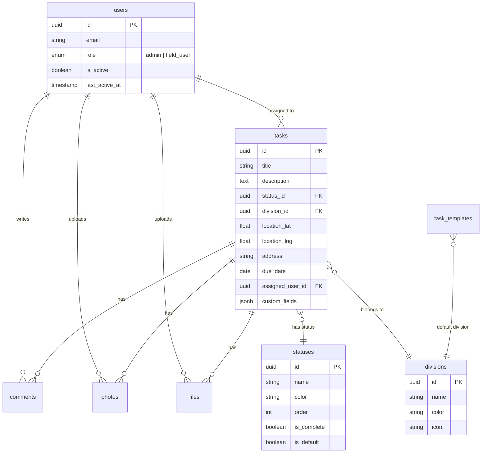

<div align="center">

# FieldOps

### Modern Field Service Management Platform

A production-ready, offline-first Progressive Web App for field service teams.
Built with Next.js 16, Supabase, and a premium design system.

[](https://nextjs.org/)
[](https://www.typescriptlang.org/)
[](https://supabase.com/)
[](https://tailwindcss.com/)
[](https://web.dev/progressive-web-apps/)

---

**[Live Demo](#) · [Documentation](#features) · [Getting Started](#getting-started) · [Contributing](#contributing)**

</div>

---

## Overview

**FieldOps** is a comprehensive field service management platform designed for companies that need to coordinate between office administrators and field crews. Whether you're managing construction sites, service calls, inspections, or maintenance work — FieldOps provides a seamless experience that works even without internet connectivity.

### Why FieldOps?

| Challenge | Solution |
|-----------|----------|
| Field crews work in areas with poor connectivity | **Offline-first architecture** with automatic sync |
| Gloves and harsh conditions make small buttons unusable | **Large touch targets** (64px minimum) designed for real-world use |
| Generic tools don't match company branding | **Full white-label support** with custom colors, logo, and app name |
| Complex software requires extensive training | **Intuitive mobile-first design** that just works |

---

## Features

### For Field Users

<table>
<tr>
<td width="50%">

#### Task Management
- View assigned tasks with status, location, and due dates
- Single-tap status updates
- Filter by status, division, or assignment
- Get directions to job sites

</td>
<td width="50%">

#### Documentation
- Capture photos with automatic GPS watermarking
- Upload files (PDF, DOC, XLS up to 25MB)
- Add comments with voice-to-text support
- All uploads work offline

</td>
</tr>
</table>

### For Administrators

<table>
<tr>
<td width="50%">

#### Dashboard & Tasks
- Real-time task overview with statistics
- Create, edit, and bulk-manage tasks
- Assign tasks to field users
- Task templates for quick creation

</td>
<td width="50%">

#### Configuration
- Custom task statuses with colors
- Division/category management
- Custom fields (text, number, date, dropdown, checkbox)
- User management with role-based access

</td>
</tr>
<tr>
<td width="50%">

#### Media Gallery
- View all uploaded photos and files
- Filter by task, user, or date
- Download and export capabilities

</td>
<td width="50%">

#### Branding
- Custom logo upload
- Primary and accent color customization
- Custom app name
- Live preview of all changes

</td>
</tr>
</table>

### Platform Features

| Feature | Description |
|---------|-------------|
| **Offline Mode** | Full functionality without internet. Changes sync automatically when back online. |
| **PWA Installation** | Install on iOS, Android, or Desktop for native app experience |
| **Dark Mode** | System-aware theme with manual override |
| **Keyboard Shortcuts** | Power-user shortcuts for admin dashboard (`n` = new task, `/` = search, `?` = help) |
| **Responsive Design** | Optimized for phones, tablets, and desktops |
| **Real-time Sync** | Powered by Supabase real-time subscriptions |

---

## Tech Stack

<table>
<tr>
<td align="center" width="96">

<br>Next.js 16
</td>
<td align="center" width="96">

<br>TypeScript
</td>
<td align="center" width="96">

<br>Tailwind 4
</td>
<td align="center" width="96">

<br>Supabase
</td>
<td align="center" width="96">

<br>PostgreSQL
</td>
</tr>
</table>

### Architecture Highlights

```
┌─────────────────────────────────────────────────────────────────┐
│                        CLIENT (PWA)                              │
│  ┌─────────────┐  ┌─────────────┐  ┌─────────────────────────┐  │
│  │  React UI   │  │   Dexie.js  │  │    Service Worker       │  │
│  │  (Next.js)  │◄─┤  (IndexedDB)│◄─┤  (Offline Cache)        │  │
│  └─────────────┘  └─────────────┘  └─────────────────────────┘  │
└────────────────────────────┬────────────────────────────────────┘
                             │
                             ▼
┌─────────────────────────────────────────────────────────────────┐
│                      SUPABASE BACKEND                            │
│  ┌─────────────┐  ┌─────────────┐  ┌─────────────────────────┐  │
│  │    Auth     │  │  PostgreSQL │  │      Storage            │  │
│  │  (Session)  │  │  (with RLS) │  │  (Photos & Files)       │  │
│  └─────────────┘  └─────────────┘  └─────────────────────────┘  │
└─────────────────────────────────────────────────────────────────┘
```

---

## Getting Started

### Prerequisites

- **Node.js** 18.17 or later
- **npm** or **yarn**
- **Supabase account** (free tier works)

### 1. Clone the Repository

```bash
git clone https://github.com/skrrrttt/fieldops.git
cd fieldops
```

### 2. Install Dependencies

```bash
npm install
```

### 3. Set Up Supabase

1. Create a new project at [supabase.com](https://supabase.com)

2. Run the database migrations in order:
   ```sql
   -- Run these in the Supabase SQL Editor
   -- File: supabase/migrations/001_initial_schema.sql
   -- File: supabase/migrations/002_rls_policies.sql
   -- File: supabase/migrations/003_user_status_fields.sql
   ```

3. Create storage buckets:
   - `photos` (public)
   - `files` (public)

### 4. Configure Environment

Create a `.env.local` file:

```env
NEXT_PUBLIC_SUPABASE_URL=https://your-project.supabase.co
NEXT_PUBLIC_SUPABASE_ANON_KEY=your-anon-key
```

### 5. Run Development Server

```bash
npm run dev
```

Open [http://localhost:3000](http://localhost:3000) to see the app.

---

## Project Structure

```
fieldops/
├── app/                    # Next.js App Router
│   ├── admin/              # Admin dashboard pages
│   │   ├── dashboard/      # Overview & stats
│   │   ├── tasks/          # Task management
│   │   ├── users/          # User management
│   │   ├── divisions/      # Categories
│   │   ├── statuses/       # Custom statuses
│   │   ├── branding/       # White-label config
│   │   └── ...
│   ├── tasks/              # Field user pages
│   │   ├── [id]/           # Task detail
│   │   └── page.tsx        # Task list
│   ├── login/              # Authentication
│   └── profile/            # User settings
│
├── components/
│   ├── admin/              # Admin UI components
│   ├── tasks/              # Task components
│   ├── offline/            # Offline indicators
│   ├── pwa/                # PWA components
│   ├── theme/              # Theme toggle
│   └── ui/                 # shadcn components
│
├── lib/
│   ├── supabase/           # Database client
│   ├── offline/            # Offline sync logic
│   ├── auth/               # Authentication
│   └── [feature]/          # Feature-specific logic
│
├── supabase/
│   └── migrations/         # Database schema
│
└── public/
    ├── icons/              # PWA icons
    ├── manifest.json       # PWA manifest
    └── sw.js               # Service worker
```

---

## Database Schema



---

## Scripts

| Command | Description |
|---------|-------------|
| `npm run dev` | Start development server |
| `npm run build` | Create production build |
| `npm run start` | Start production server |
| `npm run lint` | Run ESLint |

---

## Offline Architecture

FieldOps uses a sophisticated offline-first architecture:

```
┌──────────────────────────────────────────────────────────────┐
│                     ONLINE MODE                               │
│                                                               │
│   User Action → Server Action → Supabase → Update UI         │
│                                                               │
└──────────────────────────────────────────────────────────────┘

┌──────────────────────────────────────────────────────────────┐
│                    OFFLINE MODE                               │
│                                                               │
│   User Action → Mutation Queue → IndexedDB → Optimistic UI   │
│                      │                                        │
│                      ▼                                        │
│   [When Online] → Background Sync → Supabase → Reconcile     │
│                                                               │
└──────────────────────────────────────────────────────────────┘
```

### Key Components

- **Dexie.js**: IndexedDB wrapper for local storage
- **Mutation Queue**: Stores pending changes with timestamps
- **Service Worker**: Caches app shell and assets
- **Background Sync API**: Retries failed syncs automatically
- **Conflict Resolution**: Timestamp-based conflict detection

---

## Design System

FieldOps features a custom design system built for field conditions:

### Typography
- **Headings**: Sora (geometric, modern)
- **Body**: DM Sans (clean, readable)
- **Mono**: DM Mono (data, code)

### Color Palette
- Electric blue primary (`#0ea5e9`)
- Cyan accent (`#06b6d4`)
- OKLCH color space for perceptual uniformity

### Accessibility
- Minimum 48px touch targets
- 64px primary action buttons
- High contrast mode support
- WCAG 2.1 compliant

---

## Deployment

### Vercel (Recommended)

[](https://vercel.com/new/clone?repository-url=https://github.com/skrrrttt/fieldops)

1. Click the button above
2. Add environment variables
3. Deploy!

### Other Platforms

FieldOps can be deployed to any platform that supports Next.js:
- Netlify
- Railway
- AWS Amplify
- Docker

---

## Contributing

Contributions are welcome! Please read our contributing guidelines before submitting a PR.

1. Fork the repository
2. Create your feature branch (`git checkout -b feature/amazing-feature`)
3. Commit your changes (`git commit -m 'Add amazing feature'`)
4. Push to the branch (`git push origin feature/amazing-feature`)
5. Open a Pull Request

---

## License

This project is licensed under the MIT License - see the [LICENSE](LICENSE) file for details.

---

## Acknowledgments

- [Next.js](https://nextjs.org/) - The React Framework
- [Supabase](https://supabase.com/) - Open source Firebase alternative
- [shadcn/ui](https://ui.shadcn.com/) - Beautiful UI components
- [Tailwind CSS](https://tailwindcss.com/) - Utility-first CSS
- [Lucide](https://lucide.dev/) - Beautiful icons

---

<div align="center">

**Built with care for teams that work in the real world.**

[Report Bug](https://github.com/skrrrttt/fieldops/issues) · [Request Feature](https://github.com/skrrrttt/fieldops/issues)

</div>
